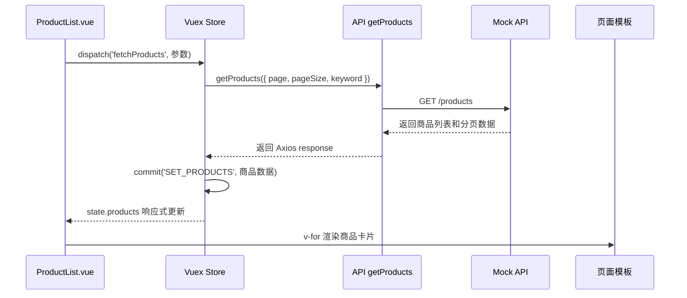

# `fetchProducts`：组件与 Vuex Store 的数据流

本文以项目中的 `fetchProducts` 为例，说明组件和 Vuex Store 如何联系，以及商品数据从 Mock 接口到页面显示的完整过程。

## 一、先看整体流程



可以简单记成：

```text
组件 dispatch
  → action 处理请求
  → API 获取数据
  → action commit
  → mutation 修改 state
  → 组件通过 mapState 获取新数据
  → 模板重新渲染
```

## 二、项目中有两个同名的 `fetchProducts`

项目中出现的两个 `fetchProducts` 作用不同。

### 1. `ProductList.vue` 中的组件方法

文件：`src/components/ProductList.vue`

```js
fetchProducts(page, keyword) {
  return this.$store.dispatch('fetchProducts', { page, keyword })
}
```

它是组件自己的方法，负责把参数交给 Vuex。

调用：

```js
this.fetchProducts(1, '')
```

这里的 `this.fetchProducts` 指的是当前组件的方法。

### 2. `store/index.js` 中的 Vuex action

文件：`src/store/index.js`

```js
async fetchProducts({ commit }, params = {}) {
  // 处理参数、调用 API，并把结果提交给 mutation
}
```

这里的 `fetchProducts` 是 Vuex action 的名字。

组件通过下面这句找到并执行它：

```js
this.$store.dispatch('fetchProducts', { page, keyword })
```

虽然两个函数名字相同，但它们属于不同对象：

```text
this.fetchProducts                    → ProductList.vue 的方法
this.$store.dispatch('fetchProducts') → Vuex 中的 action
```

## 三、第一次加载商品的过程

### 第一步：组件创建完成

`ProductList.vue` 中有：

```js
created() {
  this.fetchProducts(1, this.searchInput)
}
```

`created` 是 Vue 生命周期钩子。组件创建完成后会自动执行。

`searchInput` 的初始值来自 Vuex：

```js
data() {
  return {
    searchInput: this.$store.state.keyword,
  }
}
```

项目初始的 `keyword` 是空字符串，因此第一次调用类似于：

```js
this.fetchProducts(1, '')
```

含义是：获取第 1 页、没有搜索关键词的商品。

### 第二步：组件方法调用 `dispatch`

组件方法接收参数后执行：

```js
fetchProducts(page, keyword) {
  return this.$store.dispatch('fetchProducts', { page, keyword })
}
```

传给 Vuex 的数据是一个对象：

```js
{
  page: 1,
  keyword: '',
}
```

`dispatch` 的作用是调用 Vuex action。它本身不负责修改商品列表。

## 四、Vuex action 如何处理数据

Store 中的 action：

```js
async fetchProducts({ commit }, params = {}) {
  const page = params.page
  const keyword = params.keyword

  commit('SET_PRODUCT_QUERY', { page, keyword })
  commit('SET_PRODUCTS_LOADING', true)
  commit('SET_PRODUCTS_ERROR', '')

  try {
    const response = await getProducts({
      page,
      pageSize: 8,
      keyword,
    })

    commit('SET_PRODUCTS', response.data.data)
  } catch (error) {
    commit('SET_PRODUCTS_ERROR', getErrorMessage(error, '商品加载失败，请稍后重试'))
  } finally {
    commit('SET_PRODUCTS_LOADING', false)
  }
}
```

### `params` 是组件传来的参数

组件传入：

```js
{ page: 1, keyword: '' }
```

action 接收后：

```js
params.page      // 1
params.keyword   // ''
```

### `commit` 用来修改 state

action 中的 `commit` 是 Vuex 提供的函数。例如：

```js
commit('SET_PRODUCTS_LOADING', true)
```

表示调用名为 `SET_PRODUCTS_LOADING` 的 mutation，并传入 `true`。

这个 action 依次提交了几个 mutation：

| mutation | 作用 |
| --- | --- |
| `SET_PRODUCT_QUERY` | 保存当前页码和搜索关键词 |
| `SET_PRODUCTS_LOADING` | 控制加载状态 |
| `SET_PRODUCTS_ERROR` | 清空或保存错误信息 |
| `SET_PRODUCTS` | 保存请求成功后的商品数据 |

## 五、API 函数如何连接到 Mock

Store 中调用：

```js
const response = await getProducts({
  page,
  pageSize: 8,
  keyword,
})
```

`getProducts` 定义在 `src/api/shop.js`：

```js
export function getProducts(params = {}) {
  return http.get('/products', { params })
}
```

它通过 Axios 发起请求，并把参数作为请求参数传递：

```text
GET /products?page=1&pageSize=8&keyword=
```

项目启动时，`src/main.js` 引入了：

```js
import './mock'
```

因此这个请求会被 `src/mock/index.js` 中的代码拦截：

```js
mock.onGet('/products').reply((config) => {
  const { page = 1, pageSize = 8, keyword = '' } = config.params || {}
  // 根据 keyword 筛选，再根据 page 和 pageSize 分页
})
```

Mock 最后返回类似这样的数据：

```js
{
  list: [
    {
      id: 1,
      name: '机械键盘',
      price: 299,
      stock: 12,
      image: 'https://...'
    }
  ],
  total: 16,
  page: 1,
  pageSize: 8
}
```

## 六、响应数据如何写入 Store

Mock 返回结果经过 Axios 包装后，action 中使用：

```js
commit('SET_PRODUCTS', response.data.data)
```

这里有两层 `data`：

```text
response.data          → Axios 的响应主体
response.data.data     → Mock 用 { data } 包装的业务数据
```

传给 mutation 的数据是：

```js
{
  list: [...],
  total: 16,
  page: 1,
  pageSize: 8,
}
```

对应的 mutation：

```js
SET_PRODUCTS(state, payload) {
  state.products = payload.list
  state.totalProducts = payload.total
  state.currentPage = payload.page
  state.pageSize = payload.pageSize
}
```

这一步之后，商品数据正式保存到了：

```js
store.state.products
```

Vuex 的约定是：mutation 负责修改 state，action 通常负责异步请求和业务流程。

## 七、组件如何拿到更新后的商品

`ProductList.vue` 使用 `mapState`：

```js
computed: {
  ...mapState([
    'products',
    'totalProducts',
    'currentPage',
    'pageSize',
    'productsLoading',
    'productsError',
  ]),
}
```

这相当于让组件拥有类似下面的计算属性：

```js
computed: {
  products() {
    return this.$store.state.products
  },
}
```

因此模板中可以直接使用：

```html
<article v-for="product in products" :key="product.id">
  
  <h2>{{ product.name }}</h2>
  <span>库存 {{ product.stock }}</span>
  <strong>¥ {{ money(product.price) }}</strong>
</article>
```

当 mutation 修改 `state.products` 后，`mapState` 会感知到变化，Vue 会自动重新渲染模板。

组件不需要手动调用 `render`，也不需要手动刷新页面。

## 八、加载状态和错误状态

请求开始时：

```js
commit('SET_PRODUCTS_LOADING', true)
```

模板中的条件判断会显示骨架屏：

```html
<div v-if="productsLoading" class="product-grid">
  <!-- 骨架屏 -->
</div>
```

请求结束时：

```js
finally {
  commit('SET_PRODUCTS_LOADING', false)
}
```

如果请求失败：

```js
commit('SET_PRODUCTS_ERROR', errorMessage)
```

模板就会显示错误提示：

```html
<el-alert v-else-if="productsError" :title="productsError" />
```

如果请求成功但商品数组为空：

```html
<div v-else-if="!products.length">
  没有找到相关商品
</div>
```

## 九、搜索、分页和重试为什么都能复用它？

因为它们最终都调用同一个组件方法：

```js
this.fetchProducts(page, keyword)
```

只是传入的参数不同：

| 场景 | page | keyword |
| --- | ---: | --- |
| 首次加载 | `1` | 当前搜索词 |
| 搜索商品 | `1` | 输入框内容 |
| 翻页 | 当前页码 | 当前搜索词 |
| 重新加载 | 当前页码 | 当前搜索词 |

统一使用 `fetchProducts` 后，所有场景都会经过相同的数据流程：

```text
组件方法
  → dispatch action
  → getProducts API
  → Mock 筛选和分页
  → commit mutation
  → 更新 Vuex state
  → ProductList.vue 重新显示
```

## 十、最重要的对应关系

| 代码 | 含义 |
| --- | --- |
| `this.fetchProducts(...)` | 调用组件自己的方法 |
| `this.$store.dispatch('fetchProducts', data)` | 调用 Vuex action |
| `async fetchProducts(...)` | action 接收参数并处理请求 |
| `getProducts(...)` | 调用 API 层函数 |
| `commit('SET_PRODUCTS', data)` | 调用 mutation |
| `SET_PRODUCTS(state, payload)` | 修改 Vuex state |
| `mapState(['products'])` | 把 state 映射到组件 |
| `v-for="product in products"` | 遍历并显示商品 |

一句话总结：

> `ProductList.vue` 负责发起操作和显示结果，Vuex action 负责组织数据请求，API/Mock 负责提供数据，mutation 负责把数据写入 state，组件再通过 `mapState` 自动获得并显示更新后的数据。
